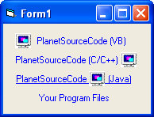

## HyperlinkLabelControl\.ocx

### Description

This is a hyperlink label control that has dozens of great features and properties such as the ability to control its HOVER state, text, use and image and place it EXACTLY where you wish on the control and much much more. This is my attempt at mimicking C#.net linkLabel control and it came out very nice..i think you will enjoy :-)
 
### More Info
 

             |
---                |---
**Submitted On**   |2006-01-18 20:12:38
**By**             |[dan aprobee](https://github.com/Planet-Source-Code/PSCIndex/blob/master/ByAuthor/dan-aprobee.md)
**Level**          |Intermediate
**User Rating**    |5.0 (15 globes from 3 users)
**Compatibility**  |VB 5\.0, VB 6\.0
**Category**       |[Custom Controls/ Forms/  Menus](https://github.com/Planet-Source-Code/PSCIndex/blob/master/ByCategory/custom-controls-forms-menus__1-4.md)
**World**          |[Visual Basic](https://github.com/Planet-Source-Code/PSCIndex/blob/master/ByWorld/visual-basic.md)
**Archive File**   |[HyperlinkL1966381182006\.zip](https://github.com/Planet-Source-Code/dan-aprobee-hyperlinklabelcontrol-ocx__1-64085/archive/master.zip)

